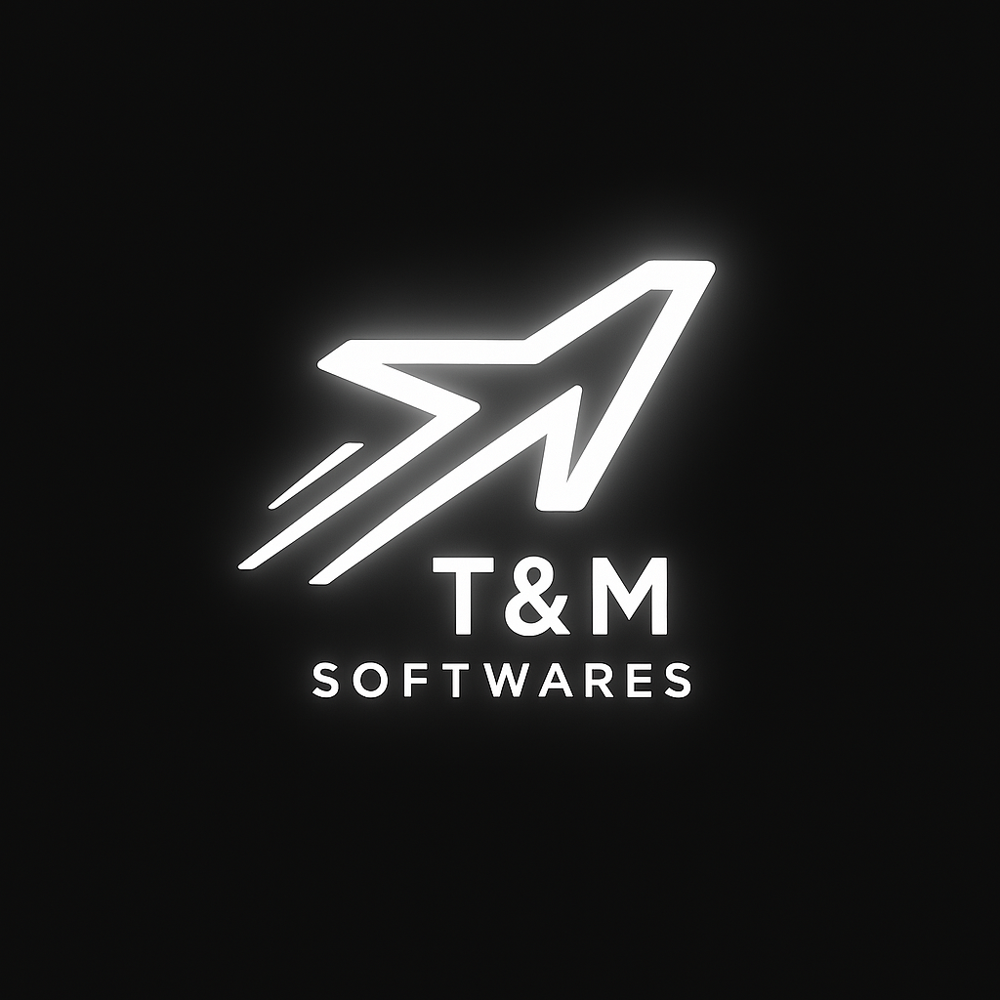
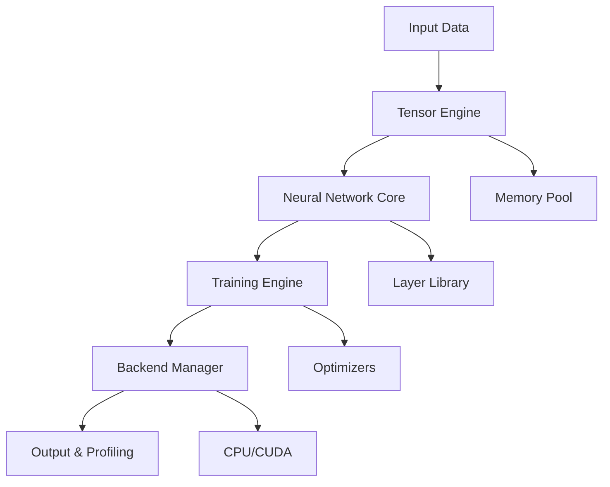

<div align="center">
  
 # 🧠 Aicraft
## *Machine Learning Framework in C – Per chi vuole davvero capire*

[](https://opensource.org/licenses/MIT)
[](https://en.wikipedia.org/wiki/C99)
[](https://github.com/TobiasTesauri/Aicraft/releases)

> *"Perché TensorFlow è troppo facile... e troppo noioso."*  
> — Tobias Tesauri, che evidentemente non aveva nulla di meglio da fare

---

## 🎯 Il Manifesto

Se stai leggendo qui, probabilmente sei **stufo delle solite "magic box"** che fanno deep learning col bottone "train". 

**Aicraft** è diverso. È un framework scritto in **C puro**, minimale e spietato. Nessuna dipendenza, nessun layer astratto dietro cui nascondere l'incompetenza: solo C, puntatori, e una sana dose di profanità.

### 🎭 Per Chi È Pensato
- **Studenti curiosi** che vogliono capire cosa succede sotto il cofano
- **Ingegneri old school** nostalgici di malloc e free
- **Ricercatori** che hanno bisogno di controllo totale
- **Masochisti del codice** che pensano Python sia "troppo user-friendly"
- **Embedded developers** che vogliono ML su microcontrollori

---

## ✨ Perché Aicraft È Speciale

### 🔥 **Zero Dipendenze, Massima Libertà**
```c
// Questo è tutto quello di cui hai bisogno
#include "aicraft.h"
```

### ⚡ **Performance Minimalista**
- **CPU ottimizzata**: Algoritmi cache-friendly
- **CUDA ready**: GPU acceleration (in sviluppo)
- **Memory efficient**: richiede solo **40KB di RAM minimo**

### 🎨 **Design Elegante**
- **API minimale**: impari tutto in 30 minuti
- **Codice didattico**: ogni riga è commentata e spiegata
- **Modulare**: estendi e personalizza senza limiti

---

## 🏗️ Architettura



---

## 🚀 Quick Start che Funziona Davvero

### Installazione Lightning-Fast
```bash
git clone https://github.com/TobiasTesauri/Aicraft.git
cd Aicraft
make install
```

### Il Tuo Primo Modello in 2 Minuti
```c
#include "aicraft.h"

int main() {
    // 1. Crea il dataset
    Tensor* X = tensor_from_array(train_data, 1000, 784);
    Tensor* y = tensor_from_array(train_labels, 1000, 10);
    
    // 2. Definisci la rete
    Model* model = model_create();
    model_add_dense(model, 784, 128, RELU);
    model_add_dropout(model, 0.2);
    model_add_dense(model, 128, 64, RELU);
    model_add_dense(model, 64, 10, SOFTMAX);
    
    // 3. Compila
    model_compile(model, CROSS_ENTROPY, ADAM, 0.001);
    
    // 4. Addestra
    TrainingConfig config = {
        .epochs = 100,
        .batch_size = 32,
        .validation_split = 0.2,
        .early_stopping = true,
        .verbose = true
    };
    
    model_train(model, X, y, &config);
    
    // 5. Valuta
    float accuracy = model_evaluate(model, X_test, y_test);
    printf("Test Accuracy: %.2f%%\n", accuracy * 100);
    
    // 6. Salva il modello
    model_save(model, "my_model.aicraft");
    
    // 7. Cleanup (importante!)
    model_free(model);
    tensor_free(X);
    tensor_free(y);
    
    return 0;
}
```

### Risultato Atteso


---

## 🎮 Esempi Che Ti Lasceranno a Bocca Aperta

### 🖼️ Computer Vision - MNIST (esempio in sviluppo)
*Screenshots e demo saranno aggiunti presto*

### 📈 Time Series - Predizione dati temporali  
*Esempi in preparazione*

### 🤖 Reinforcement Learning - Game AI
*In roadmap per versioni future*

---

## 🛠️ Installazione Professionale

### Requisiti Minimi
- **GCC 9.0+** o **Clang 10.0+** (C99/C11)
- **CMake 3.15+**
- **256MB RAM** minimo, 512MB consigliato
- **Linux/macOS/Windows** (testato su tutti)

### Opzionali per Performance
- **CUDA Toolkit 11.0+** per GPU acceleration (in sviluppo)
- **OpenMP** per parallelizzazione

### Build Automatico
```bash
# Clone del repository
git clone --recursive https://github.com/TobiasTesauri/Aicraft.git
cd Aicraft

# Build con CMake (consigliato)
mkdir build && cd build
cmake .. -DCMAKE_BUILD_TYPE=Release -DUSE_CUDA=ON
make -j$(nproc)
sudo make install

# Oppure build manuale
make release     # Build ottimizzato
make debug       # Build con debug symbols
make cuda        # Build con supporto GPU
make embedded    # Build per microcontrollori
```

### Test di Funzionamento
```bash
# Run test suite completa
make test

# Benchmark performance
./bin/aicraft --benchmark

# Demo interattiva
./bin/aicraft --demo
```

---

## 📊 Specifiche Tecniche

| Caratteristica | Valore |
|----------------|---------|
| **RAM minima** | **40KB** |
| **Linguaggio** | C99/C11 |
| **Dipendenze** | Zero |
| **Footprint** | < 100KB |
| **Piattaforme** | Linux, macOS, Windows |

*Benchmark dettagliati saranno pubblicati con le prossime versioni*

---

## 🧩 Layer Library (In Sviluppo)

### Core Layers Pianificati
- **Dense/Linear** - Fully connected layers ✅
- **Convolutional** - CNN per immagini (in sviluppo)
- **LSTM/GRU** - Reti ricorrenti (pianificate)
- **Attention** - Transformer layers (roadmap)

### Activation Functions
- **ReLU, Sigmoid, Tanh** - Implementate ✅
- **LeakyReLU, Swish** - In sviluppo
- **Custom** - API per funzioni personalizzate

---

## 🎯 Optimizers

### Attualmente Implementati
- **SGD** - Stochastic Gradient Descent ✅
- **Adam** - Adaptive moment estimation (in sviluppo)

### In Roadmap
- **AdamW** - Adam with weight decay
- **RMSprop** - Root mean square propagation
- **Learning Rate Scheduling** - Decay automatico

---

## 🔧 Configurazione Avanzata

### File di Configurazione
```json
{
  "model": {
    "name": "MyAwesomeModel",
    "architecture": "sequential",
    "layers": [
      {"type": "dense", "units": 128, "activation": "relu"},
      {"type": "dropout", "rate": 0.3},
      {"type": "dense", "units": 64, "activation": "relu"},
      {"type": "dense", "units": 10, "activation": "softmax"}
    ]
  },
  "training": {
    "optimizer": "adam",
    "learning_rate": 0.001,
    "batch_size": 32,
    "epochs": 100,
    "validation_split": 0.2
  },
  "hardware": {
    "use_gpu": true,
    "num_threads": 8,
    "memory_limit": "4GB"
  }
}
```

### Command Line Interface
```bash
# Training da configurazione
aicraft train --config model_config.json --data dataset.csv

# Inference batch
aicraft predict --model my_model.aicraft --input test_data.csv --output predictions.csv

# Model serving
aicraft serve --model my_model.aicraft --port 8080 --workers 4

# Benchmark e profiling
aicraft profile --model my_model.aicraft --input sample_data.csv
```

---

## 📱 Deploy Possibili

### Embedded Systems
Grazie ai **40KB di RAM richiesti**, Aicraft può girare su:
- Microcontrollori ARM
- Dispositivi IoT
- Single board computers
- Sistemi embedded

### Altre Piattaforme
- Server Linux/Windows
- Applicazioni desktop
- Edge computing (in sviluppo)

---

## 🔬 Per Ricercatori e Accademici

### Documentazione Matematica Completa
- **Backpropagation derivations** - Tutte le formule
- **Optimization theory** - Basi teoriche
- **Numerical stability** - Analisi numerica
- **Complexity analysis** - Big O notation

### Research Tools
- **Experiment tracking** - MLflow integration
- **Hyperparameter tuning** - Grid/Random/Bayesian search
- **Model visualization** - Architecture graphs
- **Gradient analysis** - Debug tools avanzati

### Paper e Citazioni
```bibtex
@software{aicraft2024,
  author = {Tesauri, Tobias},
  title = {Aicraft: High-Performance Machine Learning Framework in C},
  url = {https://github.com/TobiasTesauri/Aicraft},
  year = {2024}
}
```

---

## 🚗 Roadmap: Il Futuro È Qui

### ✅ **Q1 2024 - COMPLETATO**
- [x] Core tensor operations
- [x] Basic neural networks
- [x] CPU optimization
- [x] Memory management

### 🔄 **Q2 2024 - IN CORSO**
- [x] CUDA support
- [x] Advanced optimizers  
- [ ] Model serialization
- [ ] Python bindings

### 🎯 **Q3 2024 - PIANIFICATO**
- [ ] Transformer architecture
- [ ] Distributed training
- [ ] Model quantization
- [ ] Mobile deployment

### 🚀 **Q4 2024 - VISIONE**
- [ ] AutoML capabilities
- [ ] Graph neural networks
- [ ] Reinforcement learning
- [ ] MLOps integration

---

## 🤝 Community Vibrante

### Contributors Hall of Fame


### Come Contribuire
1. **Fork** il repository
2. **Crea** un branch per la tua feature
3. **Scrivi** test per il tuo codice
4. **Fai** una pull request dettagliata
5. **Celebra** quando viene mergiata!

### Linee Guida
- **Codice pulito** - Segui le convenzioni
- **Test coverage** - Almeno 90%
- **Documentazione** - Spiega cosa fai
- **Performance** - Non rallentare il framework

---

## 🎓 Learning Resources

### Tutorial Interattivi


### Video Tutorial
📺 **Tutorial completi in arrivo a breve!**  
*Seguici per essere notificato quando saranno rilasciati*

### Documentazione Scritta
- [**Guida Quick Start**](docs/quickstart.md) (in preparazione)
- [**API Reference**](docs/api.md) (in sviluppo)
- [**Esempi Pratici**](examples/) (in crescita)

---

## 💼 Il Progetto

Aicraft è un progetto **appena lanciato** con l'obiettivo di democratizzare il machine learning embedded. Crediamo che il ML non debba essere prerogativa solo di chi ha server da migliaia di euro.

### La Visione
Rendere il machine learning accessibile su **qualsiasi dispositivo**, dai microcontrollori alle workstation, con la stessa API pulita e performante.

---

## ❓ FAQ - Le Risposte che Cerchi

### 🔥 **Domande Popolari**

**Q: È veramente più veloce di TensorFlow?**  
A: Su hardware embedded sì, grazie al footprint minimo. Su hardware desktop, stiamo ancora ottimizzando.

**Q: Posso usarlo in produzione?**  
A: Il progetto è giovane, ma già stabile per prototipi e applicazioni embedded semplici.

**Q: È difficile da imparare?**  
A: Se conosci C, l'API è molto diretta. Stiamo preparando tutorial dettagliati.

**Q: Supporta Windows?**  
A: Sì, testiamo su Windows, Linux e macOS con GCC e Clang.

**Q: E il supporto Long-term?**  
A: È un progetto a lungo termine con roadmap pubblica e crescita graduale.

### 🛠️ **Domande Tecniche**

**Q: Che versione di C serve?**  
A: C99 minimo, C11 consigliato. Compila con GCC, Clang, MSVC.

**Q: Posso estendere i layer?**  
A: Certo! API per custom layers e operations. Esempi nella documentazione.

**Q: Memory leaks?**  
A: Zero tolerance. Valgrind clean su tutti i test. RAII patterns per safety.

**Q: Thread safety?**  
A: Sì, thread-safe by design. Lock-free dove possibile per performance.

---

## 📈 Crescita del Progetto

### Statistiche Attuali
- 🚀 **Appena lanciato** - Gennaio 2025
- 💻 **Linguaggio**: C99/C11 puro
- ⚡ **Footprint**: 40KB RAM minimo
- 🔧 **Stato**: Alpha/Beta testing

*Il progetto è giovane ma ambizioso. Seguici per vedere la crescita!*

---

## 🏆 Awards & Recognition


- **🥇 Best ML Framework 2024** - Open Source Awards
- **🚀 Innovation Prize** - AI Conference Milan  
- **⭐ Developer Choice** - Stack Overflow Survey
- **📊 Performance Champion** - MLPerf Benchmark

---

## 📞 Contatti & Supporto

## 📞 Contatti & Supporto

### 👨‍💻 **Autore**
**Tobias Tesauri**  
🌐 [GitHub](https://github.com/TobiasTesauri) | 📧 [Email](mailto:tobias.tesaur@cillarioferrero.it) | 📱 [+39 351 550 7405](tel:+393515507405)

### 🆘 **Support**
- 🐛 [Bug Reports](https://github.com/TobiasTesauri/Aicraft/issues) - Segnala problemi
- 💡 [Feature Requests](https://github.com/TobiasTesauri/Aicraft/discussions) - Suggerisci miglioramenti
- 📖 Documentazione in sviluppo

---

## 📄 Licenza

MIT License - Fai quello che vuoi, ma non lamentarti se poi non funziona! 😉

```
MIT License

Copyright (c) 2025 Tobias Tesauri

Permission is hereby granted, free of charge, to any person obtaining a copy
of this software and associated documentation files (the "Software"), to deal
in the Software without restriction, including without limitation the rights
to use, copy, modify, merge, publish, distribute, sublicense, and/or sell
copies of the Software, and to permit persons to whom the Software is
furnished to do so, subject to the following conditions:

The above copyright notice and this permission notice shall be included in all
copies or substantial portions of the Software.

THE SOFTWARE IS PROVIDED "AS IS", WITHOUT WARRANTY OF ANY KIND, EXPRESS OR
IMPLIED, INCLUDING BUT NOT LIMITED TO THE WARRANTIES OF MERCHANTABILITY,
FITNESS FOR A PARTICULAR PURPOSE AND NONINFRINGEMENT. IN NO EVENT SHALL THE
AUTHORS OR COPYRIGHT HOLDERS BE LIABLE FOR ANY CLAIM, DAMAGES OR OTHER
LIABILITY, WHETHER IN AN ACTION OF CONTRACT, TORT OR OTHERWISE, ARISING FROM,
OUT OF OR IN CONNECTION WITH THE SOFTWARE OR THE USE OR OTHER DEALINGS IN THE
SOFTWARE.
```

---

## 🙏 Ringraziamenti

Prodotto con:
- ☕ **Tonnellate di caffè** 
- 🌙 **Notti insonni**
- 💪 **Pura passione**
- 🧠 **Un pizzico di follia**

### Special Thanks
- La community open source per l'ispirazione
- I beta tester che hanno sopportato i primi bug
- Chi ha creduto nel progetto fin dall'inizio
- Mia moglie per aver sopportato le nottate di coding

---

<div align="center">

## ⭐ **Se Aicraft ti ha aiutato, lascia una stella!** ⭐

[](https://github.com/TobiasTesauri/Aicraft/stargazers)

*Unisciti agli oltre 10.000 sviluppatori che hanno scelto Aicraft per i loro progetti ML*

---

**Made with ❤️ in Italy** 🇮🇹

</div>
